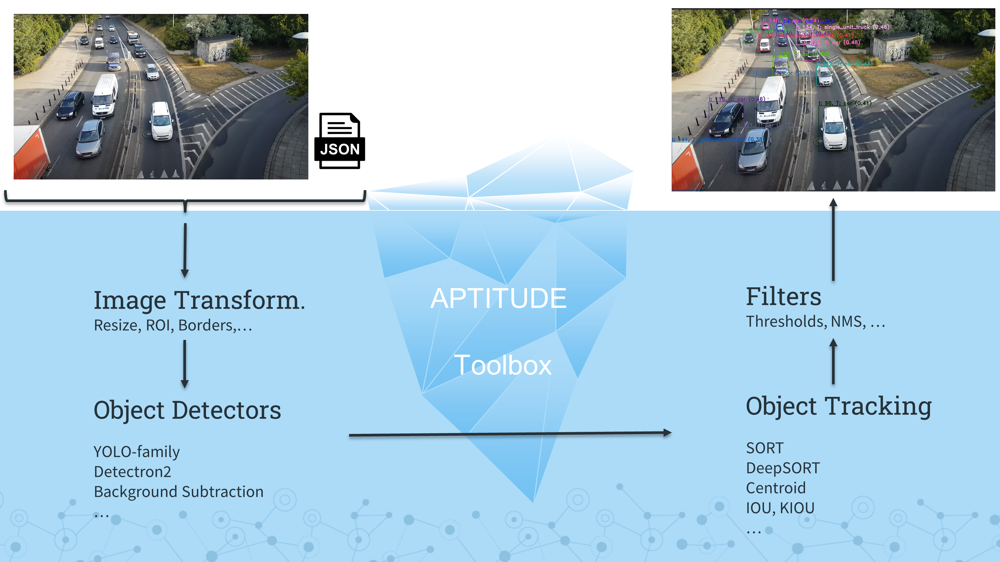

# APTITUDE Toolbox

 

## Description

The APTITUDE Toolbox gathers open-source implementations of state-of-the-art algorithms for the detection and tracking of moving objects. It integrates popular frameworks such as OpenCV, Tensorflow and Pytorch and it is made easy-to-use via an all-in-one interface.

Once installed, the toolbox takes a video and a config file as input and can output an annotated video as well as the result of the detection and tracking in MOT format. Preprocessing methods are available to resize, apply a mask or add borders. Also, postprocessing methods can be used to filter the results with different thresholds. The following figure illustrates the pipeline:



Currently, the APTITUDE toolbox can infer bounding boxes via YOLO-family, Detectron2 models or thanks to background subtraction methods. On the tracking side, SORT, DeepSORT, Centroid, IOU and KIOU can be used to keep track of the objects on subsequent frames. 

A video demo showing the results of the inference can be consulted [here](https://youtu.be/d5Dtp69EJC4).

## Prerequisites

The APTITUDE toolbox can be run on CPU. However, it is highly recommended to use a high-end GPU in order to obtain real-time performance. 

**Thus, to use the toolbox with GPU, you should have CUDA and cuDNN installed before proceeding to the installation. It was tested with CUDA 11.0 and cuDNN 8, using previous versions may lead to unexcpeted results**
<!-- Refer to [this link]() for their installation. -->


## Installation

<details> 
  <summary>Using Docker (recommended)</summary>

If you want to infer result with the provided models or with your own model, we recommend to download the last Docker image (link available soon) or build it yourself. To do so, enter the following command. The build process should last ~15 minutes.

```
git clone https://github.com/Trusted-AI-Labs/APTITUDE_Toolbox/
docker build -t apt_tb .
```

⚠️ You need at least 10GB of storage to build the image with all the dependencies.

Once built, type `docker images` and you should see the image ready to use.

```
REPOSITORY    TAG                                 IMAGE ID       CREATED        SIZE
apt_tb        0.1.4                               1b4926340c4b   3 hours ago    9.05GB
nvidia/cuda   11.0.3-cudnn8-runtime-ubuntu20.04   630325e68c55   2 months ago   3.85GB
```
</details>

<details> 
  <summary>Using Anaconda</summary>

If you don't want to use Docker or if you want contribute to the project, you can clone and manually install the dependencies.

```
conda create -n apt_tb python=3.7
conda activate apt_tb
git clone https://github.com/Trusted-AI-Labs/APTITUDE_Toolbox/
cd APTITUDE_Toolbox
pip install -r requirements/requirements.txt
pip install -e .
```

Then, you can use the wheel file to install OpenCV, which is already built with CUDA. 

For Windows:
```
pip install requirements/opencv_contrib_python-4.5.1.48-cp37-cp37m-win_amd64.whl
```
For Linux:
```
pip install requirements/opencv_contrib_python-4.5.1.48-cp37-cp37m-linux_x86_64.whl
```

Otherwise, refer to [this link](https://pypi.org/project/opencv-python/) (manual builds section) to build it yourself.

Additionally, if you are on Linux want to use Detectron2, you can install the following dependencies:
```
pip install torch==1.7.1+cu110 -f https://download.pytorch.org/whl/torch_stable.html
pip install torchvision==0.8.2+cu110 -f https://download.pytorch.org/whl/torch_stable.html
pip install torchaudio==0.7.2 -f https://download.pytorch.org/whl/torch_stable.html
pip install detectron2 -f https://dl.fbaipublicfiles.com/detectron2/wheels/cu110/torch1.7/index.html
```

However, if you are on Windows, this last pip install command does not work. Refer to their [repo](https://github.com/facebookresearch/detectron2) to see how to install on Windows.

<details> 
  <summary>Troubleshooting 🔫</summary>


On Windows, in case you get the following error when importing cv2:

```
from .cv2 import *
ImportError: DLL load failed: The specified module could not be found
```

This might be because the path to a DLL is missing. Try to add to your path the following folders:
```
<your-path>\Anaconda3\envs\apt_tb
<your-path>\envs\apt_tb\Lib\site-packages\h5py
```

The first one is for the python37.dll, the second one is for hdf5.dll. If this is not sufficient, try to use [Dependencies](https://github.com/lucasg/Dependencies) to look for any other missing DLL  of `<your-path>\Anaconda3\envs\apt_tb\Lib\site-packages\cv2\cv2.cp37-win_amd64.pyd`.

</details>

</details>


## Usage

### Use as a Black Toolbox

The toolbox comes with two "client" scripts that can be used to produce an annotated video and/or to get the results of the inference in MOT format. `tracker_client_video.py` processes a sequence of images while `tracker_client_video` processes a video file. In both cases, `clients/main.py` is the script to run. In accordance with the input type (folder of file), it calls the right script. In the following table, the parameters of this script are described. The bold lines indicate those that are mandatory.

| Parameter | | Description | Default
| --------| ------ | ----------- | ----------- |
| **-d** |**--detector** | **Path to detector config (json file).** | 
| **-t** |**--tracker** | **Path to tracker config (json file).** |
| **-c** |**--classes** | **Path to classes (json file)** | 
| **-p** |**--path** | **Path to video file / folder path containing images (.png/.jpg/.bmp) in lexical order.**|
| -fi |--frame_interval | Interval between two detections + tracking. | 1
| -gt |--ground_truth_path | Path to ground truth file in MOT format. It will be displayed in white. |
| -hl |--headless | Whether the video is shown while being processed. | False
| -rp |--record_path | Path of the output video file. |
| -rf |--record_fps | FPS of the output video file. | 10
| -mp |--mot_path | Path to the result of tracking in MOT format.
| -a | --async | For video files only. Whether the video reading is asynchronous. | False

The detector and tracker configuration JSON files can be created using the *APTITUDE Toolbox Config Creator*. Simply open `config_creator/index.html` in your web browser. The *Video* fields are not needed since it is given using the above parameters.

NB: Config files for Detectron2, BackgroundSubtraction, IOU and KIOU cannot be created (yet) in the config creator. Example files can be provided on demand.

The classes JSON config file contains the name of the object classes that can be detected by your detector. It will be displayed along with the detected objects. For example: 
```
{
    "classes": [
        "articulated_truck",
        "bicycle",
        "bus",
        "car",
        "motorcycle",
        "motorized_vehicle",
        "non-motorized_vehicle",
        "pedestrian",
        "pickup_truck",
        "single_unit_truck",
        "work_van"
    ]
}
```

Then, you can run the `clients/main.py` with you environment or your Docker container. To use the latter, create some volumes to share config files, models and videos with it(`-v` option). You can keep the container interactive (`-it` option). For instance:

```
docker run -it \
-v <your-path>/APTITUDE_Toolbox/configs/:/code/configs \
-v <your-path>/APTITUDE_Toolbox/models/:/code/models \
-v <your-path>/APTITUDE_Toolbox/videos:/code/videos \
pytb:0.1.3 python ./clients/main.py -d configs/detect-DM-docker.json -t configs/track-sort.json -c configs/classes.json -p videos/video.mp4 -hl -rp /code/out.mp4
```

If you wish to extract the output video from the container, you can use the following command:

```
docker cp <container_name>:/code/out.mp4 ~/pytb/videos/out.mp4
```

where the name of the container can be found using `docker ps -a`

### Use the Toolbox Components

This section is work in progress. 🔨

## Acknowledgement

The APTITUDE toolbox comes from the APTITUDE project (**A**pprentissage **P**rofond et **T**raitement des **I**mages pour la **T**élésurveillance **U**rbaine et la **D**étection d’**E**vénements) funded by the Walloon Region of Belgium (#1910045).