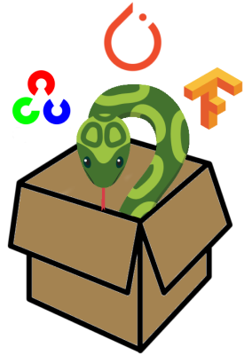

# APTITUDE Toolbox

 

## Description

The APTITUDE Toolbox gathers open-source implementations of state-of-the-art algorithms for the detection and tracking of moving objects. It integrates popular frameworks such as OpenCV, Tensorflow and Pytorch and it is made easy-to-use via an all-in-one interface.

Once installed, the toolbox takes a video and a config file as input and can output an annotated video as well as the result of the detection and tracking in MOT format. Preprocessing methods are available to resize, apply a mask or add borders. Also, postprocessing methods can be used to filter the results with different thresholds. The following figure illustrates the pipeline:


Currently, the APTITUDE toolbox can infer bounding boxes via YOLO-family, Detectron2 models or thanks to background subtraction methods. On the tracking side, SORT, DeepSORT, Centroid, IOU and KIOU can be used to keep track of the objects on subsequent frames. 

A video demo showing the results of the inference can be consulted [here](https://youtu.be/d5Dtp69EJC4).

## Prerequisites

The APTITUDE toolbox can be run on CPU. However, it is highly recommended to use a high-end GPU in order to obtain real-time performance. 

**Thus, to use the toolbox with GPU, you should have CUDA and cuDNN installed before proceeding to the installation. It was tested with CUDA 11.3 and cuDNN 8.3.2, using previous versions may lead to unexpected results**
<!-- Refer to [this link]() for their installation. -->


## Installation

### Using Docker (recommended)

Since version 0.2.3, deployment via Docker is only available to TRAIL affiliates.
Becoming a TRAIL affiliate allows you to get in touch with a community of researchers, industries and entrepreneurs in the domain of AI. 
Learn more on [https://trail.ac/](https://trail.ac/)

### Using Anaconda

Before anything else, please install [ffmpeg](https://ffmpeg.org/download.html) on your machine

If you don't want to use Docker or if you want contribute to the project, you can clone and manually install the dependencies.

```
conda create -n apt_tb python=3.9
conda activate apt_tb
git clone https://github.com/Trusted-AI-Labs/APTITUDE_Toolbox/
cd APTITUDE_Toolbox
pip install -r requirements/requirements.txt
pip install -e .
```

Then, you can use the wheel file to install OpenCV, which is already built with CUDA. 

For Windows:
```
pip install requirements/opencv_contrib_python-4.5.5-cp39-cp39-win_amd64.whl
```
For Linux:
```
pip install requirements/opencv_contrib_python-4.5.5.64-cp39-cp39-linux_x86_64.whl
```

Next, enter the following commands to install PyTorch with targeting the CUDA version:
```
pip install torch==1.10.2+cu113 -f https://download.pytorch.org/whl/cu113/torch_stable.html
pip install torchvision==0.11.3+cu113 -f https://download.pytorch.org/whl/cu113/torch_stable.html
```
Otherwise, refer to [this link](https://pypi.org/project/opencv-python/) (manual builds section) to build it yourself.

Additionally, if you are on Linux want to use Detectron2, you can install the following dependencies:
```
pip install detectron2 -f https://dl.fbaipublicfiles.com/detectron2/wheels/cu113/torch1.10/index.html
```

However, if you are on Windows, you must build it from source. Refer to their [repository](https://github.com/facebookresearch/detectron2) to see how to install on Windows.


### Troubleshooting 🔫


On Windows, in case you get the following error when importing cv2:

```
from .cv2 import *
ImportError: DLL load failed: The specified module could not be found
```

This might be because the path to a DLL is missing. Try to add to your path the following folders:
```
<your-path>\Anaconda3\envs\apt_tb
<your-path>\envs\apt_tb\Lib\site-packages\h5py
```

The first one is for the python39.dll, the second one is for hdf5.dll. If this is not sufficient, try to use [Dependencies](https://github.com/lucasg/Dependencies) to look for any other missing DLL  of `<your-path>\Anaconda3\envs\apt_tb\Lib\site-packages\cv2\cv2.cp37-win_amd64.pyd`.


## Usage

### Models

Models trained on [MIO-TCD Localization dataset](https://tcd.miovision.com/challenge/dataset.html) are available on our [drive](https://drive.google.com/drive/folders/1di8gys9LwbLFeFTY7dLA6PqG4nX5TLSD?usp=sharing). 
Feel free to try them with the APTITUDE Toolbox before training your own.

We advise to create a /models/ and a /videos/ folder so that you can easily switch from a model/video to another. 

### Use as a Black Toolbox

The toolbox comes with two "client" scripts that can be used to produce an annotated video and/or to get the results of the inference in MOT format. `tracker_client_video.py` processes a sequence of images while `tracker_client_video` processes a video file. In both cases, `clients/main.py` is the script to run. In accordance with the input type (folder of file), it calls the right script. In the following table, the parameters of this script are described. The bold lines indicate those that are mandatory.

| Parameter | | Description | Default
| --------| ------ | ----------- | ----------- |
| **-d** |**--detector** | **Path to detector config (json file).** | 
| **-t** |**--tracker** | **Path to tracker config (json file).** |
| **-c** |**--classes** | **Path to classes (json file)** | 
| **-p** |**--path** | **Path to video file / folder path containing images (.png/.jpg/.bmp) in lexical order.**|
| -fi |--frame_interval | Interval between two detections + tracking. | 1
| -gt |--ground_truth_path | Path to ground truth file in MOT format. It will be displayed in white. |
| -hl |--headless | Whether the video is shown while being processed. | False
| -ds |--display_size | Dimension of the video shown as it is processed: width,height. |
| -rp |--record_path | Path of the output video file. |
| -rf |--record_fps | FPS of the output video file. | 10
| -rs |--record_size | Dimension of the recorded video: width,height. Each image is resized just before being written. |
| -mp |--mot_path | Path to the result of tracking in MOT format.
| -a | --async | For video files only. Whether the video reading is asynchronous. | False

The detector and tracker configuration JSON files can be created using the *APTITUDE Toolbox Config Creator*. Simply open `config_creator/index.html` in your web browser. The *Video* fields are not needed since it is given using the above parameters.

Example config files are available in /configs/, you can try them directly after changing the paths to your own model paths.

NB: The creation of a MaskRCNN config is not (yet) available in the config creator. Example files can be provided on demand.

The classes JSON config file contains the name of the object classes that can be detected by your detector. It will be displayed along with the detected objects. For example: 
```
{
    "classes": [
        "articulated_truck",
        "bicycle",
        "bus",
        "car",
        "motorcycle",
        "motorized_vehicle",
        "non-motorized_vehicle",
        "pedestrian",
        "pickup_truck",
        "single_unit_truck",
        "work_van"
    ]
}
```

Then, you can run the `clients/main.py` with you configured environment and the above parameters. 

### Use the Toolbox Components

This section is work in progress. 🔨

## Acknowledgement

The APTITUDE toolbox comes from the APTITUDE project (**A**pprentissage **P**rofond et **T**raitement des **I**mages pour la **T**élésurveillance **U**rbaine et la **D**étection d’**E**vénements) funded by the Walloon Region of Belgium (#1910045).

## References

Refer to the following repositories for more information on individual algorithms. Part of the code present in this repository was adapted from those repositories, see individual source files for details.

YOLO & Tiny-YOLO (v2-4) inference: [OpenCV Documentation - DNN module](https://docs.opencv.org/4.5.3/d0/db7/tutorial_js_table_of_contents_dnn.html)

YOLOv5 inference: [Ultralytics - YOLOv5](https://github.com/ultralytics/yolov5)

MaskRCNN: [Pytorch models](https://pytorch.org/vision/stable/models.html)

SORT: [abewley - SORT](https://github.com/abewley/sort)

DeepSORT : [nwojke - DeepSORT](https://github.com/nwojke/deep_sort) & [LeonLok - DeepSORT inference](https://github.com/LeonLok/Deep-SORT-YOLOv4)

IOU : [bochinski - IOU](https://github.com/bochinski/iou-tracker)

KIOU: [siyuanc - KIOU](https://github.com/siyuanc2/kiout)

Centroid : [pyimagesearch - Centroid](https://www.pyimagesearch.com/2018/07/23/simple-object-tracking-with-opencv/)

This repository is released under GPL-3.0 License, please consult LICENSE file for details.